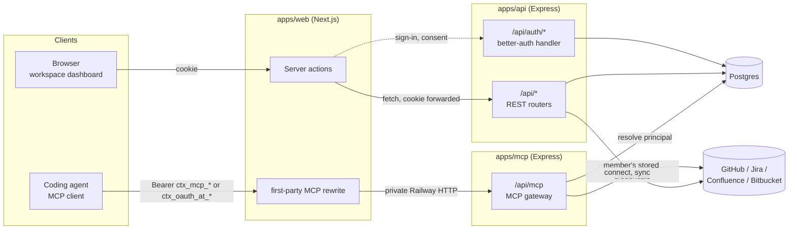
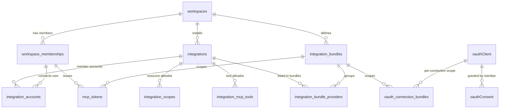
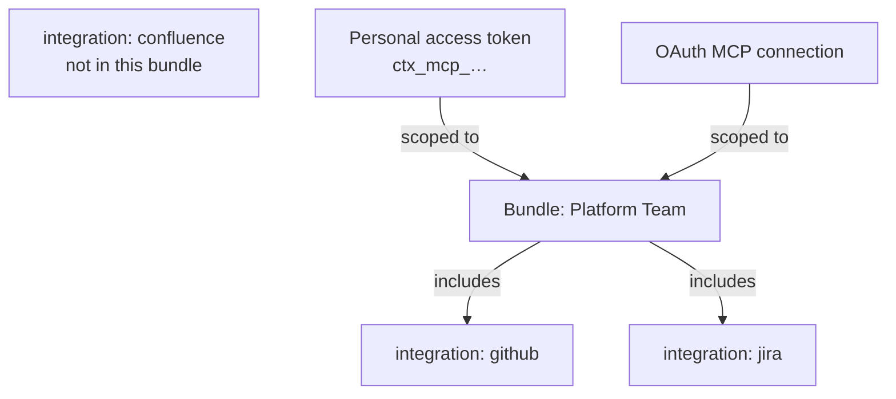
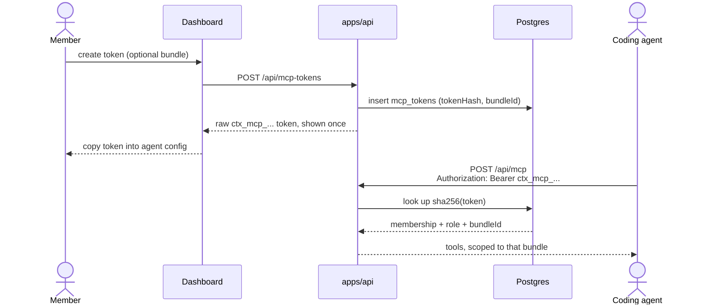
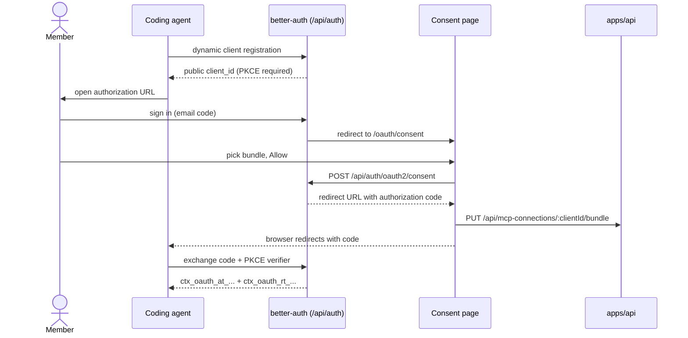
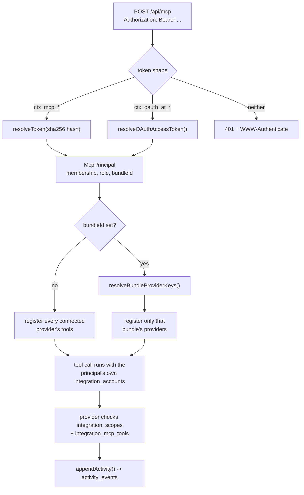

# Context Layer &mdash; system overview

Context Layer lets a coding agent pull live, permissioned context&mdash;repositories, issues,
pages&mdash;out of a team's connected tools over MCP. This doc maps how the pieces fit
together: providers, integrations, bundles, the two ways an agent gets in, and the gateway
that ties them to one request path.

At a glance:

- **4** providers wired in (GitHub, Jira, Confluence, Bitbucket)
- **2** MCP credential paths (personal access token, OAuth)
- **1** gateway endpoint (`POST /api/mcp`)
- **0** default access &mdash; every allowlist is deny-by-default

## Contents

1. [System map](#1-system-map)
2. [Core data model](#2-core-data-model)
3. [Providers](#3-providers)
4. [Integrations](#4-integrations)
5. [Bundles](#5-bundles)
6. [Platform auth](#6-platform-auth)
7. [MCP access &mdash; two credential paths](#7-mcp-access--two-credential-paths)
8. [The MCP gateway](#8-the-mcp-gateway)
9. [Glossary](#9-glossary)

## 1. System map

Three applications, one database, one public origin.

`apps/web` is a Next.js app that renders the workspace dashboard. It holds no session logic
and never talks to Postgres. Next.js sends the exact MCP execution and protected-resource
paths to `apps/mcp`, while every other API path goes to `apps/api`. `apps/api` owns the REST
routers, `better-auth`, OAuth consent, webhooks, and MCP credential management. `apps/mcp`
owns stateless tool discovery and invocation. Both backend services share Postgres through
`packages/db` and provider behavior through `packages/integrations`.

> The dashboard never touches the database directly. It uses the cookie-authenticated API
> control plane, while agents use the bearer-authenticated MCP execution plane; both enforce
> the same workspace and provider policy from Postgres.

## 2. Core data model

A workspace is the tenant root. Everything else hangs off it, in a ladder from "installed" to
"allowed."

A `workspace` has members (`workspace_memberships`), each with a role of `owner` or `member`
&mdash;a user belongs to at most one workspace. Installing a provider creates one
`integrations` row per workspace+provider; each member who wants to use it authorizes their
own `integration_accounts` row against it. Neither step grants any MCP access by itself:
`integration_scopes` and `integration_mcp_tools` are separate, empty-by-default allowlists
that an owner has to populate before an agent can see a repository or call a tool.
`integration_bundles` group installed integrations for scoping purposes, and both MCP
credential families&mdash;`mcp_tokens` and the `oauthClient`/`oauthConsent` family&mdash;can
reference a bundle to narrow what they see.

Relationship-level view, not a full schema&mdash;table and column names match
`packages/db/migrations` exactly. `integration_bundle_providers` references the workspace's
`integrationId`, not the provider key, so a bundle survives a disconnect/reconnect.

> **Deny-by-default, twice over.** A connected provider grants nothing on its own. An owner
> has to add rows to `integration_scopes` (which repositories, projects, or spaces are
> visible) and `integration_mcp_tools` (which of that provider's tools are callable at all)
> before any agent request can touch it.

## 3. Providers

A provider is a self-registering module, not a hardcoded special case.

Each context provider lives under `packages/integrations/src/<name>/` and exports a
`ProviderModule`: a `ProviderDefinition` (capabilities, display labels, scope kinds, and its
full MCP tool catalogue, each tool marked `read` or `write`) plus an `IntegrationAdapter`
(authorization URL, code exchange, resource/scope discovery, credential refresh) and, if it
has the `context` capability, a factory for its `McpToolProvider`. `createProviderRegistry`
validates every definition at startup&mdash;an MCP tool not prefixed with its own provider
key, a capability declared without its matching label, or a duplicate scope key all fail fast
rather than surface as a runtime bug.

| Provider       | Resource                | Selected     | Tools | Examples                                                                    |
| -------------- | ----------------------- | ------------ | ----- | --------------------------------------------------------------------------- |
| **GitHub**     | GitHub App installation | at install   | 18    | `github_list_repositories`, `github_get_file`, `github_create_pull_request` |
| **Jira**       | Jira site               | during OAuth | 11    | `jira_search_issues`, `jira_create_issue`, `jira_transition_issue`          |
| **Confluence** | Confluence site         | during OAuth | 9     | `confluence_search_pages`, `confluence_create_page`                         |
| **Bitbucket**  | Bitbucket workspace     | at install   | 9     | `bitbucket_list_pull_requests`, `bitbucket_search_code`                     |

Jira and Confluence share one Atlassian OAuth client and ADF (Atlassian Document Format)
reader under `integrations/atlassian/`&mdash;it isn't a provider itself, just shared plumbing
for the two that are.

## 4. Integrations

Installing a provider and connecting to it are two different actions, done by two different
people.

An owner installs a provider once per workspace&mdash;that's the `integrations` row, holding
non-secret configuration only. From there, every member who wants to use it runs their own
OAuth authorization against the adapter, producing their own `integration_accounts` row with
credentials held in a versioned, AES-256-GCM-encrypted envelope bound to that specific
record. This is deliberate: an MCP call always runs as a real, auditable person's provider
account, never a shared service credential.

Where in that flow the specific resource gets picked depends on the provider's
`resourceSelection`. GitHub and Bitbucket are `application`-selected&mdash;you choose the
GitHub App installation or Bitbucket workspace once, up front. Jira and Confluence are
`authorization`-selected&mdash;the site is chosen inside each member's own OAuth consent
screen. Either way, connecting an account is still just step one: an owner then has to
allowlist specific resources (`integration_scopes`&mdash;a repository, a Jira project, a
Confluence space) and specific tools (`integration_mcp_tools`) before anything becomes
reachable over MCP.

## 5. Bundles

A bundle is a named subset of a workspace's installed providers, used only to narrow what one
MCP credential can see.

Without a bundle, a personal access token or an OAuth connection can see every connected
provider a workspace has enabled. A bundle lets its owner say "this credential only needs
GitHub and Jira"&mdash;the gateway strips every other provider's tools out before the agent
ever lists them. Membership is stored against the workspace's `integrationId`, not a raw
provider key, so a bundle keeps its meaning across a disconnect-and-reconnect. An empty
bundle is legal; a credential scoped to one just sees nothing.

Either credential type can point at the same bundle. A request authenticated with either one
only ever sees `github_*` and `jira_*` tools&mdash;Confluence is invisible, not just
unauthorized. Bundles are visible and usable across the workspace, but the membership that
created a bundle is its only editor. Workspace owners can delete any bundle for
administration, while other members can delete only their own.

## 6. Platform auth

One identity provider for the whole system: better-auth, mounted inside the API.

Humans sign in passwordless, with a six-digit code emailed via Resend&mdash;password
authentication is explicitly disabled. A signed-in user has at most one workspace
membership, and that membership's role gates what they can do: an `owner` installs
providers, manages members, and can administratively delete any bundle; every member can
create and manage their own bundles, connect their own provider accounts, and mint their own
personal access tokens. `apps/web` never talks to Postgres or resolves a session
itself&mdash;it forwards the incoming cookie to `apps/api` on every request and trusts
whatever that returns.

## 7. MCP access &mdash; two credential paths

An agent needs a bearer credential to call the gateway. Two very different mechanisms
produce the same shape on the other end.

### Personal access tokens

A signed-in member mints a `ctx_mcp_...` token from the dashboard, optionally scoped to a
bundle at creation. The raw token is shown exactly once; only its SHA-256 hash is ever
stored. Every call that token makes runs as the member who created it&mdash;
`createdByMembershipId` is the acting identity for the whole life of the token. Revocation is
soft (`revokedAt`) so the audit trail survives, but the token stops resolving immediately.

The dashboard is the only place the raw token ever appears. Every subsequent hop sees only
its hash.

### OAuth 2.1 (dynamically registered MCP clients)

better-auth's `oauthProvider` plugin implements MCP's client-auth pattern: an agent
registers itself as a public client on the fly&mdash;no client secret, PKCE required&mdash;
then runs a normal browser authorization-code flow against a human's session. After sign-in,
the member lands on `/oauth/consent`, sees which client is asking, picks a bundle from the
same picker personal tokens use, and approves. Consent is recorded first; the bundle choice
is written to the connection immediately after, so a failure to save the bundle narrows the
connection to "every connected provider" rather than blocking the login the client is
already waiting on. A successful grant yields a short-lived `ctx_oauth_at_...` access token
(one hour) and a `ctx_oauth_rt_...` refresh token (one year), both stored hashed, each bound
by an audience claim to this deployment's own `/api/mcp` resource URL.

Consent is granted before the bundle is written&mdash;the connection can always fall back to
unscoped, but it can never leave the user mid-authorization on a bundle-save failure.

> **Same principal, either path.** Whichever credential an agent presents, the gateway
> resolves it down to one shape&mdash;a membership, a role, and an optional bundle&mdash;
> before it does anything else. Neither path can act as anyone but the human who authorized
> it.

## 8. The MCP gateway

Every agent call, on either credential path, lands on one public endpoint: `POST /api/mcp`.
Next.js preserves that first-party URL while forwarding execution to the private, independently
scalable `apps/mcp` Railway service.

`packages/mcp-runtime` is the single protocol boundary that turns a bearer token into a set of callable tools.
It reads the token's shape to pick a resolver (`ctx_mcp_...` vs `ctx_oauth_at_...`), builds a
fresh, stateless MCP server for the request, and&mdash;before registering a single
tool&mdash;filters the workspace's provider modules down to the principal's bundle, if it has
one. Every tool that survives that filter still enforces its own provider-level allowlists: a
tool handler fetches credentials for the specific membership behind the request, then checks
`integration_scopes` and `integration_mcp_tools` before it will touch the provider's API at
all.

Bundle filtering decides which tools exist at all; scope and tool allowlists decide, per
call, whether a surviving tool is allowed to run.

## 9. Glossary

| Term                      | Meaning                                                                                                                                |
| ------------------------- | -------------------------------------------------------------------------------------------------------------------------------------- |
| **Workspace**             | The tenant root. One name, one owner-or-many-members roster, everything else scoped underneath it.                                     |
| **Membership**            | A user's single seat in a workspace, with role `owner` or `member`.                                                                    |
| **Integration**           | A provider installed once for a workspace&mdash;configuration only, no personal credentials.                                           |
| **Integration account**   | One member's own OAuth-authorized connection to an installed integration; credentials live in an encrypted envelope.                   |
| **Scope**                 | One allowlisted resource&mdash;a repository, project, or space&mdash;on an integration. No rows, no visible resources.                 |
| **MCP tool allowlist**    | Which of a provider's tools are enabled for an integration. Separate from scopes; both default to empty.                               |
| **Bundle**                | A named subset of a workspace's integrations, used to narrow what one MCP credential can see.                                          |
| **Personal access token** | A `ctx_mcp_...` credential a member mints from the dashboard; stored as a hash, acts as its creator.                                   |
| **OAuth connection**      | An agent's dynamically-registered OAuth client plus a member's granted consent; produces `ctx_oauth_at_...`/`ctx_oauth_rt_...` tokens. |
| **Principal**             | The resolved shape&mdash;membership, role, bundle&mdash;that the gateway builds from either credential before doing anything else.     |
| **Provider module**       | A self-registering module under `packages/integrations`: a definition, an adapter, and an optional MCP tool provider.                  |
| **Activity event**        | An immutable audit row appended for actions across the system, correlated per request.                                                 |

---

High-level architecture reference for Context Layer. Reflects `apps/api`, `apps/mcp`,
`apps/web`, and their shared packages as of this codebase snapshot&mdash;read the source under
each package for exact behavior.
